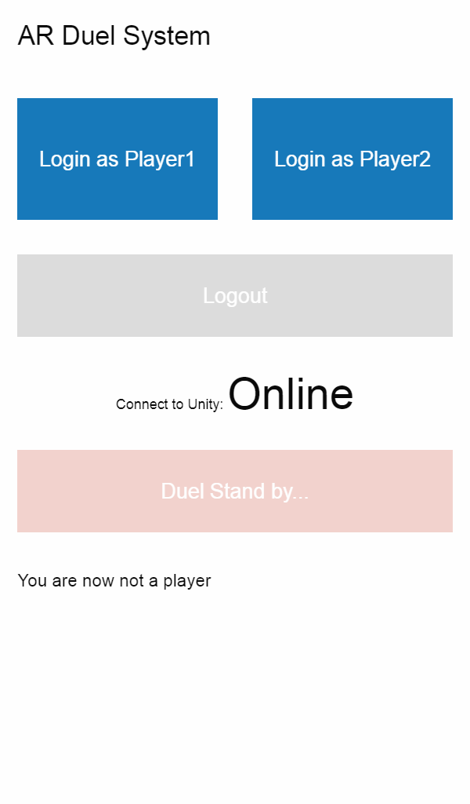
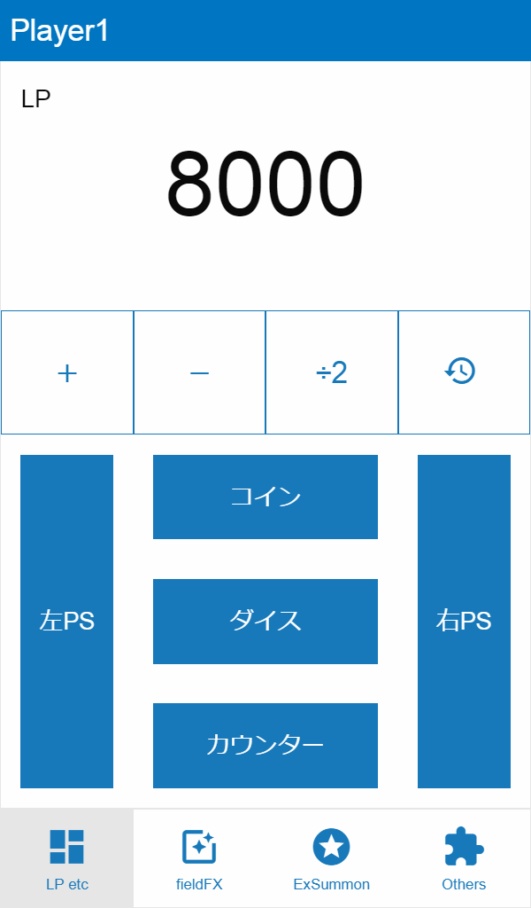
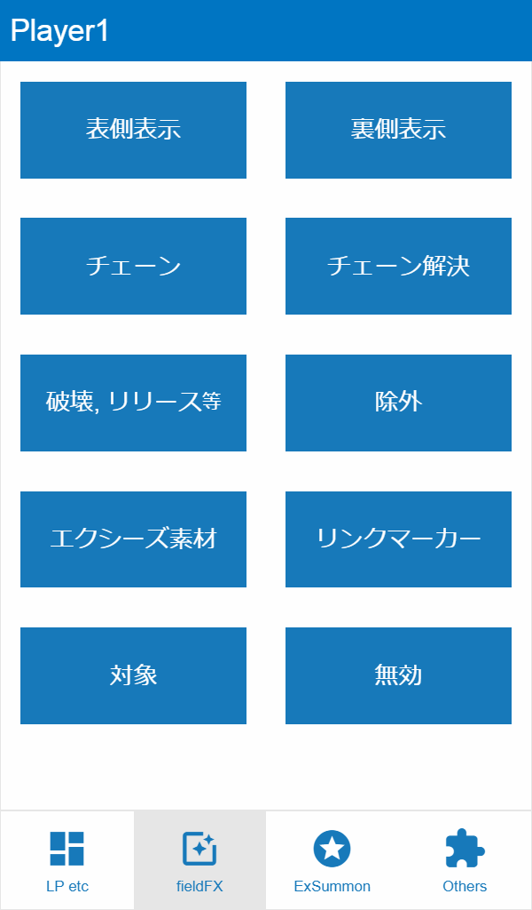
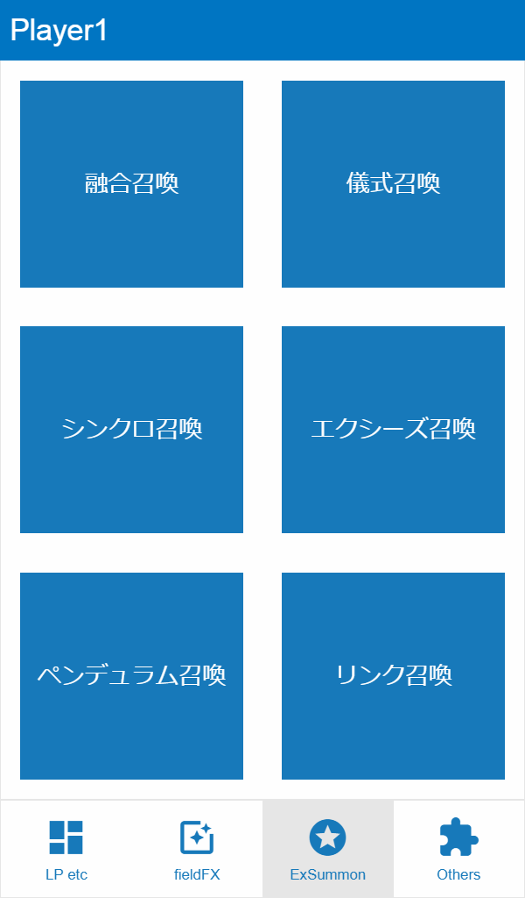
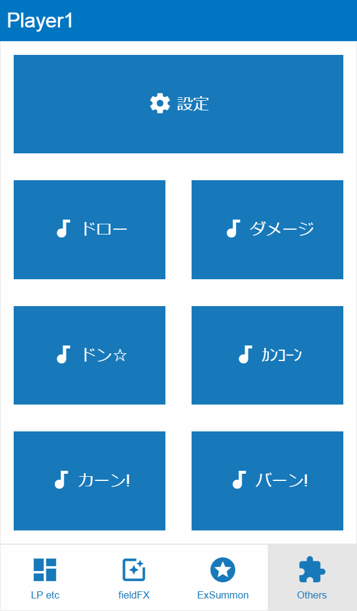

# Yu-Gi-Oh! AR Dueling System (YARDS) - Manual

----

### Changelog
* 22 Oct 2018 Starting steps.

# Before We Start

This manual is an english recreation by [My1](https://github.com/My1) of the [Japanese YARDS Manual](https://reoasxdtmgt.github.io/YARDS-manual/) by [Reo](https://twitter.com/reoasxdtmgt), creator of the YARDS System.

While I would love to help Reo from time to time with some english stuff, I am in no way, shape or form, affiliated with him, and therefore this manual is not official (YARDS itself isn't either, but whatever :-) )

With languages obviously being a very difficult subject in general and not everything being easy to translate word by word, I still attempt to bring the broad meaning and intentions of Reo, if you have any issue with the content or wording of this manual, [please file an issue](https://github.com/My1/YARDS-manual-EN/issues).

# Summary
Many Yu-Gi-Oh! Players around the world probably imagined how it would be if they would be able to play with the Solid Vision System seen time and time again in the Anime.
While it is yet impossibly to let monsters appear into thin air yet, if we remove that element, we have a decent starting point.

This manual is made to introduce the YARDS system and how to use it. While the Official Yu-Gi-Oh! Games as well as many third party projects process everything by themselves, the technology for creating such an advanced AI isn't available to us yet, therefore the entire system will be controlled with smartphones (or tablets and similar devices).

While controlling the system through your control device while doing the actual Duel is more work than usual, you are not required to use all functions, you can decide on what functions you like to use and only use those.

It would be really nice if this system would spread as a new way to play Yu-Gi-Oh!. Please try it out!

# Basic Screen Explanation

Fundamentally, there are 2 big sections of the client. The `Login Screen` and the `Home Screen`, with the Home Screen having 4 tabs.

Also on the Special summoning methods of Fusion, Ritual, Synchro, Xyz, Pendulum and Link (all together named as `Extra Summon`) each have their own sub-screen for managing those.

## Login Screen
To use this system, both players need to Log in and select themselves as either Player 1 or Player 2.

From the top:

* Login as Player 1/2: Log you in as the respective Player
* Logout: If you are signed in as any Player, you can use this button to Log out again
* Duel Stand by...: if both players are logged in, this starts the Duel, and moves both Players over to the Home Screen.

## Home Screen

Simply speaking, this is the main part of the YARDS Interface. Everything you can do in a Duel with YARDS is in here, from Summoning or activating effects to even some relatively small things.

Let's go over each Tab one by one:

### LP etc Tab

The most important part of this tab is obviously managing the LP. Each Player only sees their own LP on the Screen (the opponent's LP are visible on the Dueling field) and they can only change their own LP.

There also is a History Button which lets you view the changes of both your LP and revert to an earlier state if needed.

after that we have 1 button each on the Left and Right for the respective Pendulum Scales, as well as the "Items" (coins, dice and counters)

### Field Effects (FX) Tab

This Tab is half of the main Life of YARDS, if one may call it that way. Here you can execute a variety of effects on the Field

*Note by My1: Frankly, most of those are self explanatory, so I try to explain the effects themselves a little more*.

* `Face Up`/`Face Down`: Face up has a much more "showy" effect, while setting a card is relatively simple with the effect following that.
* `Chain`: Activating Effects and stacking a chain, on each card you get a circle of chainlinks with it's chainlink number inside starting from 1
* `Resolve Chain`: Resolves the chained cards one by one, in reverse order of chain creation, starting fron the currently highest chain link number.
* `Destroy/Tribute`: when cards leave the field by Tributing or destruction you can have them "desintegrate"
* `Banish` (older Terminology: Remove from Play): a different effect which has less showy visuals but a very unique sound to accompany banishing cards.
* `Xyz Materials`: Button: (actually this refers to the **attached** Xyz Materials, in the Anime also Referred as "Overlay Units"), here you can attach and detach Materials if needed.
* `Link Arrows`: With this you can have the "Ring" with the Link Arrows on your Link Monsters show up, as well as change Link Arrows if needed.
* `Target`: this plays a crosshair effect on cards, showing them as Targets or just to highlight them.
* `Negate`: Places a "Forbidden" Sign on the selected cards and/or Zones. Very useful not only for showing that a card's effects are negated, but also to highlight Zones that cannot be used.

### Extra Summon Tab

The other half of the big main part of YARDS. This screen acts as a transition to the screens where you do all the selections regarding Extra Summons.

`Yet another My1 Note: as the explanations here are yet again basically useless; I go into more effect explanations.`

* `Fusion`: Opens a Orange/Blue Fusion spiral (like on the Polymerization card), which then takes the materials in
* `Ritual`: Similarly to VRAINS, the Material's Levels will turn into flames and forming a circle
* `Synchro`: Like in ARC-V, the Tuner Monster's Levels will turn into big green rings, forming a "tunnel" with the Levels of the non-Tuner Monster(s) becoming stars aligning themselves in a line inside the "tunnel" creating the rings, them then connecting into a beam of light which expands.
* `Xyz` Very similar to the Fusion effect except that the Spiral  is dark purple with yellow particles, and the fact that after the Xyz Summon the monster will have the number of Materials assigned to it.
* `Pendulum`: This first creates a circle of arcs possibly inspired by Foucault's pendulum which then outputs Effects for the monsters into the selected Zones.
* `Link`: First the "Circuit" (as named in the Anime, basically a square formation of the Link Arrows) appears, with monsters then moving into the Link Arrows, and then a Ring with the Link Arrows *(called "Link Ring" in further occurences in this Manual)* into the Summoning Zone which then disappears.

### Other Tab

As the name implies, here one can do anything that hasn't been listed before.

Here we have the Settings button which (obviously) changes some settings, but also allows logging out.

Then we also have a few buttons for sound Effects, with one of them being for drawing cards, another one for (seemingly big) Damage, there are 6 effects in total, but unlike Japanese, English is not very great at explaining Sounds effects in a decent manner so [I just decided to dig up Reo's Explanation from one of his YT Streams](https://www.youtube.com/watch?v=IY_2V-lNHFg&feature=youtu.be&t=4038)) the one thing I can say however is that there are certainly some stereotypical Effects from the Anime included.
